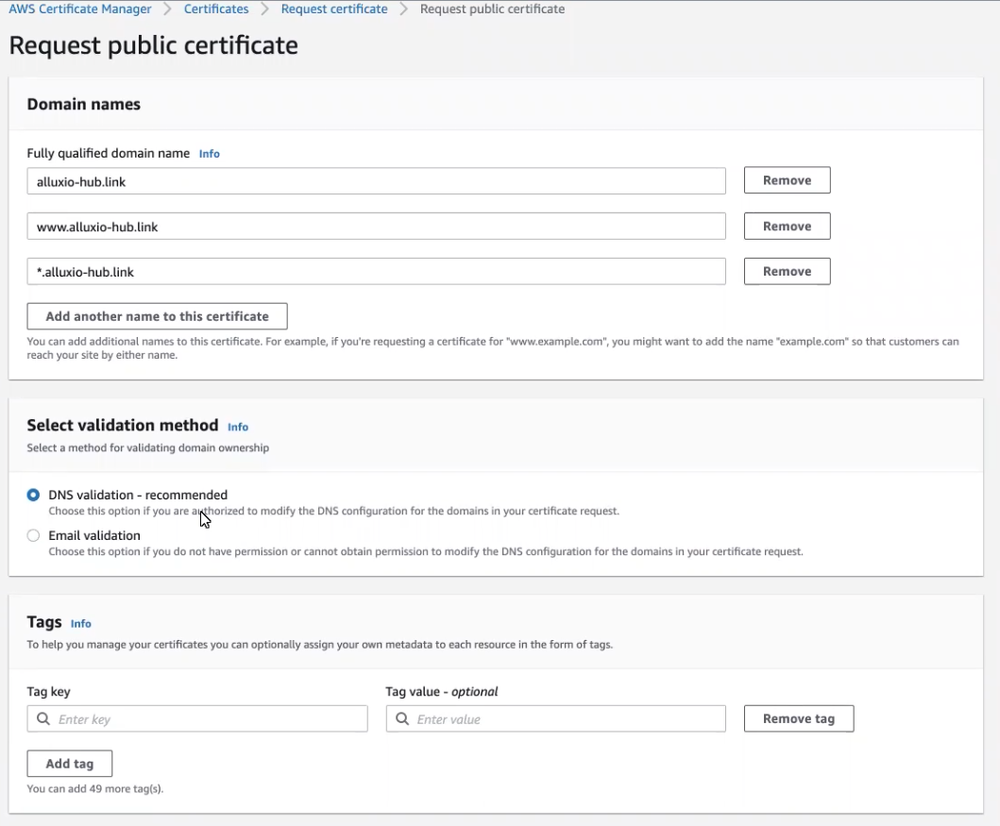
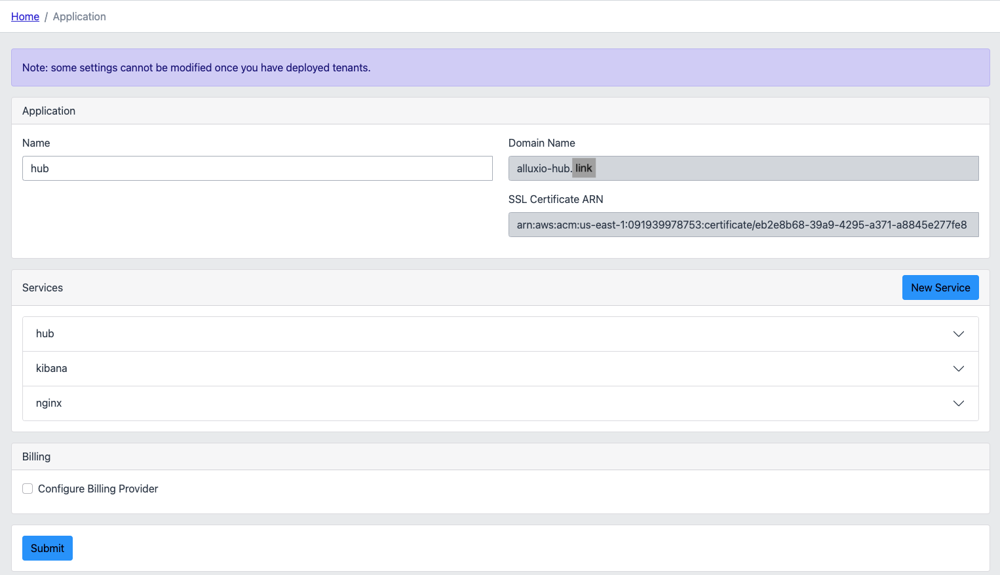
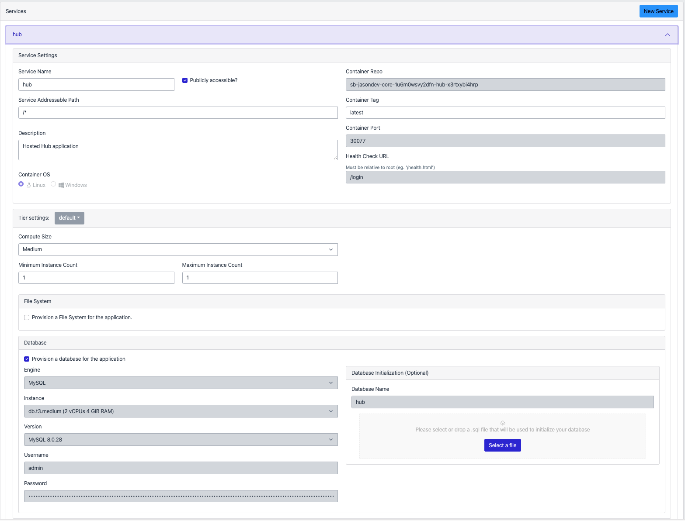
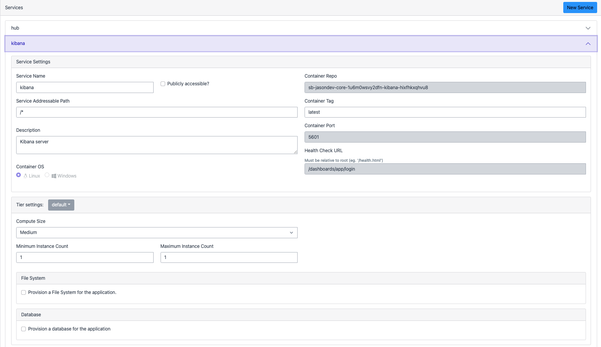
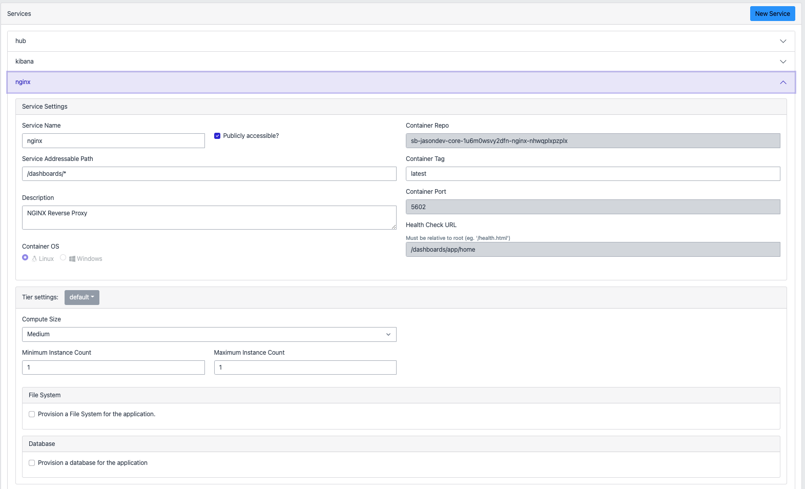

# Hub - AWS Saas Boost Setup

## AWS SaaS Boost initial setup
Make sure to use the correct Java and npm versions to run the saas-boost installer. ex:
```bash
export JAVA_HOME=/Library/Java/JavaVirtualMachines/amazon-corretto-11.jdk/Contents/Home
nvm use 14
```

Run the installer:
```bash
./install.sh
```

Follow the prompts and your answers should look something like the following:
```
Launching installer for SaaS Boost...
===========================================================
Welcome to the AWS SaaS Boost Installer
Installer Version: 026edbb
Checking maven, yarn and AWS CLI...
Environment Checks for maven, yarn, and AWS CLI PASSED.
===========================================================
 1. New AWS SaaS Boost install.
 2. Install Metrics and Analytics into existing AWS SaaS Boost deployment.
 3. Update Web Application for existing AWS SaaS Boost deployment.
 4. Update existing AWS SaaS Boost deployment.
 5. Delete existing AWS SaaS Boost deployment.
 6. Exit installer.
Please select an option to continue (1-6): 1
Directory path of Saas Boost download (Press Enter for '/Users/alluxio/git/aws-saas-boost'):
Enter name of the AWS SaaS Boost environment to deploy (Ex. dev, test, uat, prod, etc.): test
Enter the email address for your AWS SaaS Boost administrator: jason@alluxio.com
Enter the email address address again to confirm: jason@alluxio.com
Would you like to install the metrics and analytics module of AWS SaaS Boost (y or n)? n
If your application runs on Windows and uses a shared file system, Active Directory is required.
Would you like to provision AWS Directory Service to use with FSx for Windows File Server (y or n)? n

===========================================================

Would you like to continue the installation with the following options?
AWS Account: XXXXXXXX
AWS Region: us-east-1
AWS SaaS Boost Environment Name: test
Admin Email Address: jason@alluxio.com
Install optional Analytics Module: false
Amazon QuickSight user for Analytics Module: N/A
Setup AWS Directory Service for FSx for Windows File Server: false

Continue (y or n)? y
```

Setup will take a while, you'll receive an email with the Saas Boost Admin UI once it's ready.

In the meantime, register a domain and SSL/TLS certificate.

## Register domain

Go to Route 53 -> Register Domain -> Pick an available name (this tutorial uses `alluxio-hub.link` as an example)

Verify that a Route 53 Hosted Zone is created for your domain (Route 53 -> Hosted Zones).

## SSL/TLS Certificate setup for Hub

Go to AWS Certificate Manager -> Certificate -> Request Certificate

The request should look similar to the following:

*Example Certificate request*

After submitting the request, go to the Certificate page and click `Create records in Route 53`:

*Example Certificate*

Go to the Route 53 Hosted Zone for your domain and verify that records were created for your certificate. The records should end with `.acm-validation.aws.`

*Example Hosted Zone records*

Wait for all the domains to show `Success` in the Certificate's page. This means that the domains and certificates can now be used together.

*Example success states*

Now, you can set up the Hub application in the SaaS Boost Web UI.

## Hub Setup in SaaS Boost Admin Web UI

Log into the Admin Web UI and go to the `Application` page. The Hub setup should look like the following example.
- `Name`: hub
- `Domain Name`: your newly created domain 
- `SSL Certificate ARN`: ARN can be retrieved in the certificate's page in the AWS Web Console.



The Hub service should be set up like below:
Note: MySQL username/password can be anything, it will be accessed by the Hub via environment variables.


The Kibana service should be set up like below:


The NGINX service should be set up like below:


Once the application is set up and created, you'll need to push images per service before creating tenants. ECR repos can be seen at the bottom of the `Summary` page.

Example steps shown in the Admin UI. See the Hub repo for specific instructions on how to build Hub-related images:
```
Retrieve an authentication token and authenticate your Docker client to your registry. Use the AWS CLI:
aws ecr get-login-password --region us-east-1 | docker login --username AWS --password-stdin 091939978753.dkr.ecr.us-east-1.amazonaws.com
Note: If you receive an error using the AWS CLI, make sure that you have the latest version of the AWS CLI and Docker installed.

Build your Docker image using the following command. For information on building a Docker file from scratch see the instructions here . You can skip this step if your image is already built:
docker build -t saas-boost .

After the build completes, tag your image so you can push the image to this repository:
docker tag saas-boost:latest 091939978753.dkr.ecr.us-east-1.amazonaws.com/:latest

Run the following command to push this image to your newly created AWS repository:
docker push 091939978753.dkr.ecr.us-east-1.amazonaws.com/:latest
```

Once the images are pushed, you can now onboard tenants for your SaaS Boost environment.

## Onboarding New Tenants

In the Saas Boost Admin UI, go to the `Onboarding` page. Click `Provision Tenant` and enter a tenant name and subdomain (I usually keep them the same). Note that they should be unique from other tenants.

You can view the progress for the tenant via the Cloudformation stack. This is helpful for debugging purposes since if there's a failure, you can see which resource caused it and an error message associated with it.

